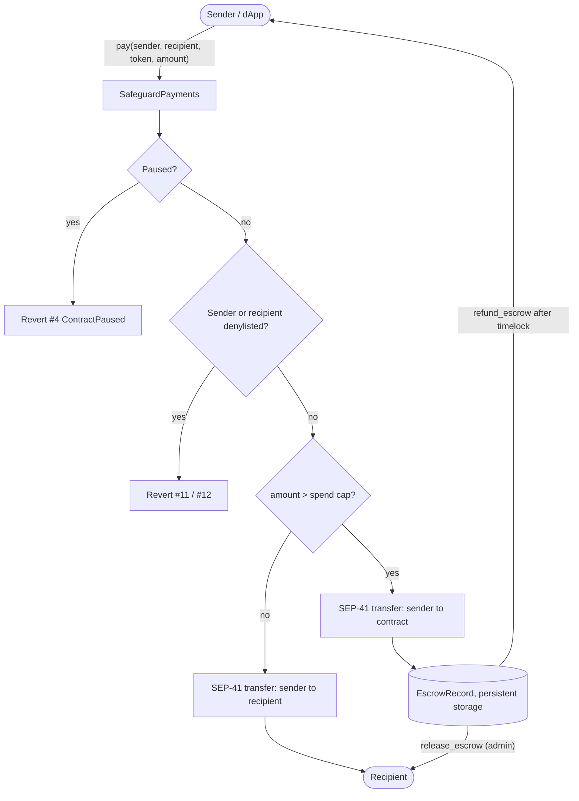

# Safeguard Contracts

[](https://github.com/Safeguard-Inc/safeguard-contracts/actions/workflows/ci.yml)
[](https://stellar.expert/explorer/testnet/contract/CDC6KVX7QT7CD3GOVGX44NQUNS7FMSZKIAXTV3TDGSXQKJRQMDZRSRCN)
[](docs/BENCHMARKS.md)
[](https://developers.stellar.org/docs/build/smart-contracts)
[](LICENSE)

**Soroban smart contracts for policy-guarded payments on Stellar.** A payment
either settles directly, goes into an on-chain escrow for review, or is
rejected before any tokens move.

[](https://safeguard-docs.vercel.app/assets/video/safeguard-pitch.mp4)

---

## Table of contents

- [Why Safeguard](#why-safeguard)
- [The Safeguard stack](#the-safeguard-stack)
- [Live Testnet deployment](#live-testnet-deployment)
- [Architecture](#architecture)
- [Repository layout](#repository-layout)
- [Contract reference: SafeguardPayments](#contract-reference-safeguardpayments)
- [Contract reference: SafeguardPolicy](#contract-reference-safeguardpolicy)
- [Error codes](#error-codes)
- [Getting started](#getting-started)
- [Deploying your own instance](#deploying-your-own-instance)
- [Fees and benchmarks](#fees-and-benchmarks)
- [Security model](#security-model)
- [Project status and roadmap](#project-status-and-roadmap)
- [Contributing (Stellar Drips Wave)](#contributing-stellar-drips-wave)
- [License](#license)

---

## Why Safeguard

Teams paying out stablecoins on Stellar for payroll, merchant settlement or
treasury operations need controls *before* money moves, not reconciliation
after it has gone. Today that usually means an off-chain service that can be
bypassed. Safeguard puts the controls in the contract:

- **Denylisted sender or recipient:** the transaction reverts and no tokens move.
- **Amount above the spend cap:** the tokens go into contract escrow, where an
  admin can release them or the sender can reclaim them after a timelock.
- **Everything else:** the payment settles directly in the same transaction.

The contracts are non-custodial on the happy path and work with any SEP-41
token, including SAC-wrapped USDC, EURC and native XLM.

## The Safeguard stack

| Repository | What it is | Tech |
| :--- | :--- | :--- |
| **`safeguard-contracts`** (this repo) | On-chain payments gateway, escrow and policy registry | Rust, Soroban SDK |
| [`safeguard-backend`](https://github.com/Safeguard-Inc/safeguard-backend) | TypeScript SDK and REST API: pre-flight checks and error decoding | TypeScript, Express |
| [`safeguard-dashboard`](https://github.com/Safeguard-Inc/safeguard-dashboard) | Operator console: checkout, policies and transaction explorer | Next.js 14, Tailwind |
| [`safeguard-docs`](https://github.com/Safeguard-Inc/safeguard-docs) | Documentation site, in-browser policy engine demo, pitch video | Static HTML/ESM, Vercel |

## Live Testnet deployment

Deployed and initialised on **2026-10-05** with `stellar-cli 28.1.0`. State was
read back from the ledger after deployment. The machine-readable record is
[`deployments/testnet.json`](deployments/testnet.json).

| Component | ID | Explorer |
| :--- | :--- | :--- |
| **SafeguardPayments** | `CDC6KVX7QT7CD3GOVGX44NQUNS7FMSZKIAXTV3TDGSXQKJRQMDZRSRCN` | [StellarExpert](https://stellar.expert/explorer/testnet/contract/CDC6KVX7QT7CD3GOVGX44NQUNS7FMSZKIAXTV3TDGSXQKJRQMDZRSRCN) |
| **SafeguardPolicy** | `CCXFDOLLLFZKAG7X6AKN2YLKET5F5X565IHZXPOAGCM7W6MJG5WKANLN` | [StellarExpert](https://stellar.expert/explorer/testnet/contract/CCXFDOLLLFZKAG7X6AKN2YLKET5F5X565IHZXPOAGCM7W6MJG5WKANLN) |
| Native XLM SAC | `CDLZFC3SYJYDZT7K67VZ75HPJVIEUVNIXF47ZG2FB2RMQQVU2HHGCYSC` | [StellarExpert](https://stellar.expert/explorer/testnet/contract/CDLZFC3SYJYDZT7K67VZ75HPJVIEUVNIXF47ZG2FB2RMQQVU2HHGCYSC) |
| Admin account | `GC5MCMHHMFV7GOQ7DVN7MOTMHGTMVIP3YFQAAVFZ6WKUE6SLGQBVODW4` | [StellarExpert](https://stellar.expert/explorer/testnet/account/GC5MCMHHMFV7GOQ7DVN7MOTMHGTMVIP3YFQAAVFZ6WKUE6SLGQBVODW4) |

**Initial configuration:** spend cap of 100 XLM (`1000000000` stroops) and an
escrow refund timelock of 24 hours (`86400` s).

**Live end-to-end proof.** Each of these is a real transaction you can open:

| Path | Result | Transaction |
| :--- | :--- | :--- |
| Approved: 50 XLM | Settled directly, `reason_code 0` | [`c762b42f…`](https://stellar.expert/explorer/testnet/tx/c762b42f818387aa584ea33d3da006f22671071ed6e182068994ea6597395e6c) |
| Escrowed: 150 XLM | Held as escrow #1, `reason_code 6` (cap exceeded) | [`2d832316…`](https://stellar.expert/explorer/testnet/tx/2d83231685f03b17e1a001e6c82c38453459b4f67b416ef60f9be73133026f0e) |
| Escrow released | Admin released #1 to the recipient | [`f1257dd8…`](https://stellar.expert/explorer/testnet/tx/f1257dd8e902c4dad2c00b8f71cc98999d9885e402fbd7959c4242202cef2331) |
| Blocked: denylisted recipient | Rejected with `RecipientDenylisted` (#11), never submitted | — |

## Architecture



`pay` always returns a `PaymentReceipt` with `status` (`Approved = 1`,
`Escrowed = 2`), a `reason_code`, and an `escrow_id` (`0` when settled
directly).

**SafeguardPolicy** is a separate, richer registry. It holds versioned and
hash-pinned policies, token bindings, and identity, sanctions and jurisdiction
registries, and exposes `evaluate()` and `is_authorized()`. Its decision logic
comes from the pure-Rust **`safeguard-core`** crate, so the same rules can be
tested off-chain and reproduced byte-for-byte in the docs site demo.

> [!NOTE]
> The payments contract currently enforces its **own** denylist and spend cap.
> Calling `SafeguardPolicy.evaluate()` from inside `pay()` is the top roadmap
> item. See [Project status and roadmap](#project-status-and-roadmap).

## Repository layout

```text
safeguard-contracts/
├── contracts/
│   ├── safeguard-payments/   # Payments gateway + escrow vault (Soroban)
│   └── safeguard-policy/     # Versioned policy registry + evaluate() (Soroban)
├── crates/
│   └── safeguard-core/       # no_std deterministic rule engine + property tests
├── policies/                 # Default policy, examples and test fixtures (JSON)
├── deployments/testnet.json  # Live deployment record
├── docs/BENCHMARKS.md        # Fees measured on Testnet
└── scripts/                  # build.sh, deploy-testnet.sh
```

## Contract reference: SafeguardPayments

| Function | Auth | Description |
| :--- | :--- | :--- |
| `initialize(admin, escrow_period: u64, spend_cap: i128)` | — | One-time setup. Fails with `AlreadyInitialized` (#2) if called again. |
| `pay(sender, recipient, token, amount: i128) -> PaymentReceipt` | `sender` | Guarded payment: settles directly, escrows, or reverts. |
| `release_escrow(escrow_id: u64)` | admin | Sends escrowed funds to the recipient. |
| `refund_escrow(caller, escrow_id: u64)` | `caller` | Returns escrowed funds to the sender once the timelock has passed (#10 before that). |
| `get_escrow(escrow_id) -> EscrowRecord` | — | Reads an escrow record (#8 if missing). |
| `get_config() -> (admin, spend_cap, escrow_period, paused, total_escrows)` | — | Reads the current configuration. |
| `set_spend_cap(new_cap)` | admin | Updates the escrow threshold. |
| `add_to_denylist(address)` / `remove_from_denylist(address)` | admin | Manages the denylist. |
| `is_denylisted(address) -> bool` | — | Checks whether an address is denylisted. |
| `set_paused(paused: bool)` | admin | Emergency stop for `pay`. |
| `set_admin(new_admin)` | admin | Transfers the admin role. |

**Try it on Testnet:**

```bash
stellar contract invoke --network testnet --source <your-key> \
  --id CDC6KVX7QT7CD3GOVGX44NQUNS7FMSZKIAXTV3TDGSXQKJRQMDZRSRCN \
  -- pay --sender <your-G-address> --recipient <G...> \
  --token CDLZFC3SYJYDZT7K67VZ75HPJVIEUVNIXF47ZG2FB2RMQQVU2HHGCYSC \
  --amount 10000000   # 1 XLM

# read-only (no fee):
stellar contract invoke --network testnet --source <your-key> --send=no \
  --id CDC6KVX7QT7CD3GOVGX44NQUNS7FMSZKIAXTV3TDGSXQKJRQMDZRSRCN -- get_config
```

## Contract reference: SafeguardPolicy

| Group | Functions |
| :--- | :--- |
| Setup and roles | `initialize(admin)`, `admin()`, `set_admin`, `add_authority` / `remove_authority`, `add_policy_authority` / `remove_policy_authority`, `schema_version()` |
| Policy lifecycle | `register_version(policy_id, version, config_hash, rules)`, `activate_version(operator, policy_id, version)`, `deactivate_version`, `get_version`, `get_active_version` |
| Token binding | `bind_token(operator, policy_id, token)`, `unbind_token`, `bound_tokens(policy_id)` |
| Registries | `set_identity` / `remove_identity` / `identity`, `set_sanctions_entry` / `retire_sanctions_entry` / `sanctions_entry`, `set_jurisdiction` / `clear_jurisdiction` / `jurisdiction` |
| Decisions | `evaluate(policy_id, token, input) -> EvaluationResult`, `is_authorized(account, token) -> bool` (fails closed) |

Policy versions are **append-only**: re-registering an existing version fails
with `VersionExists` (#11). Each version is pinned by a `config_hash`, so
auditors can match on-chain rules to the JSON in [`policies/`](policies/).

```bash
stellar contract invoke --network testnet --source <your-key> --send=no \
  --id CCXFDOLLLFZKAG7X6AKN2YLKET5F5X565IHZXPOAGCM7W6MJG5WKANLN -- schema_version
# => 1
```

## Error codes

These are the codes the contracts actually return on-chain. They are stable,
and numbers are never reused.

<details>
<summary><b>SafeguardPayments</b> (<code>PaymentError</code>)</summary>

| # | Name | When |
| ---: | :--- | :--- |
| 1 | `NotInitialized` | Called before `initialize` |
| 2 | `AlreadyInitialized` | `initialize` called twice |
| 3 | `Unauthorized` | Caller is not admin / sender |
| 4 | `ContractPaused` | `pay` while paused |
| 5 | `InvalidAmount` | `amount <= 0` |
| 6 | `SpendCapExceeded` | Used as `reason_code` on escrowed receipts |
| 7 | `PolicyDenied` | Reserved for policy-contract integration |
| 8 | `EscrowNotFound` | Unknown `escrow_id` |
| 9 | `EscrowAlreadySettled` | Released / refunded twice |
| 10 | `EscrowTimelockActive` | Refund before `release_after` |
| 11 | `RecipientDenylisted` | Recipient on denylist |
| 12 | `SenderDenylisted` | Sender on denylist |

</details>

<details>
<summary><b>SafeguardPolicy</b> (<code>ContractError</code>)</summary>

| # | Name | # | Name |
| ---: | :--- | ---: | :--- |
| 2 | `AlreadyInitialized` | 9 | `TokenNotBound` |
| 3 | `NotInitialized` | 11 | `VersionExists` |
| 4 | `PolicyNotFound` | 12 | `VersionNotActive` |
| 5 | `VersionNotFound` | 13 | `InvalidRegistryData` |
| 6 | `VersionNotDraft` | 14 | `RegistryAuthorityRequired` |
| 7 | `InvalidRuleSet` | 15 | `PolicyAuthorityRequired` |
| 8 | `PolicyNotActive` | | |

</details>

The SDK in `safeguard-backend` also ships a broader 272-entry catalog
([`docs/ERROR_CODES.md`](docs/ERROR_CODES.md)) for integrators. Use it for
human-readable messages; the tables above are the source of truth for on-chain
codes.

## Getting started

**Prerequisites:** Rust stable, the `wasm32v1-none` target, and the
[Stellar CLI](https://developers.stellar.org/docs/tools/cli).

```bash
rustup target add wasm32v1-none
cargo install --locked stellar-cli       # or grab a release binary

git clone https://github.com/Safeguard-Inc/safeguard-contracts
cd safeguard-contracts

cargo test --workspace                   # unit, contract and property tests
cargo clippy --workspace -- -D warnings
./scripts/build.sh                       # release WASMs in target/wasm32v1-none/release/
```

> [!TIP]
> **Windows:** if the MSVC host fails with `could not open 'dbghelp.lib'`,
> build with the GNU toolchain instead:
> `cargo +stable-x86_64-pc-windows-gnu build --target wasm32v1-none --release`.

## Deploying your own instance

```bash
stellar keys generate my-admin --network testnet --fund
STELLAR_IDENTITY=my-admin ./scripts/deploy-testnet.sh
```

The script builds both contracts, deploys them, initialises the policy
contract (admin) and the payments contract (admin, 24 h timelock, 100-token
cap), and writes `deployments/testnet.json`.

## Fees and benchmarks

Fees measured from real Testnet transactions. Full method and hashes are in
[`docs/BENCHMARKS.md`](docs/BENCHMARKS.md).

| Call | Fee (stroops) | XLM |
| :--- | ---: | ---: |
| `pay`: approved | 19,237 | 0.0019 |
| `pay`: escrowed (includes rent for the new escrow entry) | 739,309 | 0.0739 |
| `release_escrow` | 16,575 | 0.0017 |
| `set_spend_cap` | 6,968 | 0.0007 |
| `pay`: blocked | 0 | Fails in simulation |

## Security model

- **Explicit auth:** `pay` calls `sender.require_auth()`. Admin functions
  check the stored admin. `refund_escrow` requires the caller's signature.
- **Fails closed:** denylist and pause checks run *before* any token
  transfer, and `is_authorized` returns `false` for anything unbound or
  unknown.
- **No reentrancy surface:** escrow state is marked settled before the
  outbound transfer.
- **Overflow-checked release builds** (`overflow-checks = true`).
- **Audit status:** internally reviewed only. No external audit yet, so treat
  this as Testnet software.

Please report vulnerabilities privately as described in
[SECURITY.md](https://github.com/Safeguard-Inc/safeguard-docs/blob/main/SECURITY.md).

## Project status and roadmap

| Status | Item |
| :---: | :--- |
| ✅ | Payments gateway with direct / escrow / revert paths, live on Testnet |
| ✅ | Versioned policy registry with identity, sanctions and jurisdiction registries |
| ✅ | `safeguard-core` engine with property tests |
| 🔜 | **Wire `pay()` to `SafeguardPolicy.evaluate()`**: one source of truth for rules |
| 🔜 | Multi-sig admin via a Stellar account threshold or a governance contract |
| 🔜 | Escrow storage diet to cut rent (see BENCHMARKS) |
| 🔜 | Event schema doc and an indexer in `safeguard-backend` |
| 🔜 | External audit before Mainnet |

## Contributing (Stellar Drips Wave)

Safeguard takes part in the **Stellar Drips Wave**. Roadmap items are broken
into scoped issues with acceptance criteria and complexity labels:
[browse open issues](https://github.com/Safeguard-Inc/safeguard-contracts/issues).

1. Comment on an issue to claim it.
2. Fork, branch (`feat/…`, `fix/…`), and make sure
   `cargo test --workspace && cargo clippy -- -D warnings` passes.
3. Open a PR using the template.

See [CONTRIBUTING.md](CONTRIBUTING.md) for code style and commit conventions.

## License

[Apache-2.0](LICENSE)
