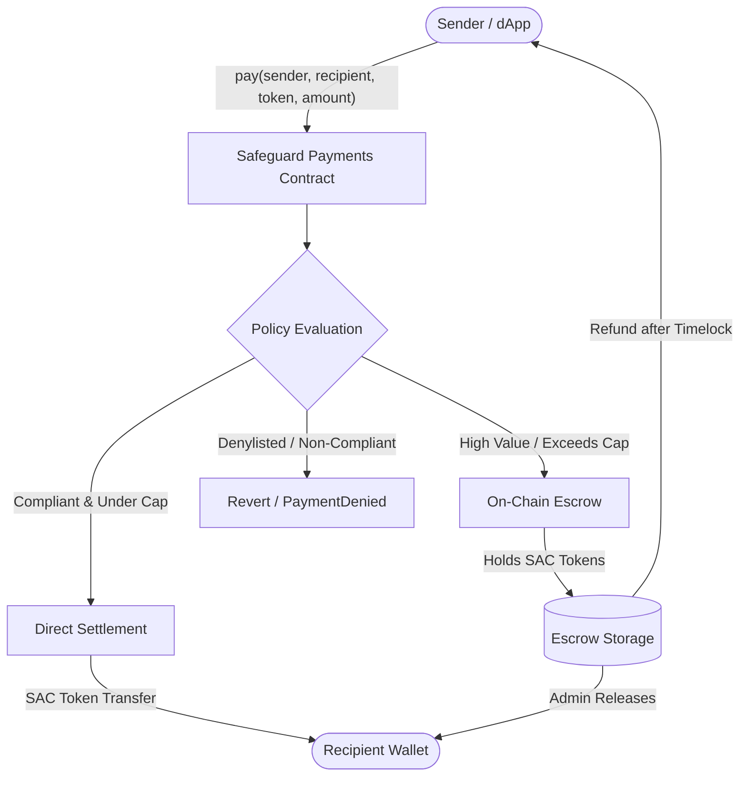

# Safeguard Contracts

[](https://github.com/Safeguard-Inc/safeguard-contracts/actions/workflows/ci.yml)
[](.github/workflows/ci.yml)
[-4ade9b.svg)](https://safeguard-docs.vercel.app/assets/video/safeguard-pitch.mp4)
[](docs/BENCHMARKS.md)
[](docs/ERROR_CODES.md)
[](LICENSE)
[](https://safeguard-dashboard-mocha.vercel.app)
[](https://stellar.org/soroban)

[](https://safeguard-docs.vercel.app/assets/video/safeguard-pitch.mp4)

**Non-custodial, policy-guarded payment gateway and deterministic compliance engine for Soroban on Stellar.**

Safeguard provides an on-chain firewall for Web3 payments, payroll disbursals, and merchant settlements in SEP-41 SAC tokens (USDC, EURC, XLM). Every transaction is evaluated deterministically against policy rules before tokens move.

---

## The Four-Tier Stack

Safeguard is structured across four purpose-built repositories:

| Repository | Role | Technology |
| :--- | :--- | :--- |
| **`safeguard-contracts`** (this repo) | Smart Contracts & Policy Engine | Rust, Soroban SDK, `no_std` |
| [**`safeguard-backend`**](https://github.com/Safeguard-Inc/safeguard-backend) | Pre-flight Simulation SDK & REST API | TypeScript, Node.js, Express |
| [**`safeguard-dashboard`**](https://github.com/Safeguard-Inc/safeguard-dashboard) | Institutional Web3 Console | Next.js 14, Freighter, Tailwind |
| [**`safeguard-docs`**](https://github.com/Safeguard-Inc/safeguard-docs) | Documentation Hub & Simulator | Static Web, Vercel |

---

## Architecture Overview



### Core Components

| Crate / Contract | Description | Tech Stack |
| :--- | :--- | :--- |
| **`crates/safeguard-core`** | Zero-dependency, pure `no_std` deterministic policy decision engine. Evaluates allowlists, denylists, spend caps, and jurisdiction rules. | Rust |
| **`contracts/safeguard-policy`** | On-chain policy registry and configuration contract. | Soroban SDK |
| **`contracts/safeguard-payments`** | Non-custodial payment gateway & escrow vault supporting all SEP-41 Stellar Asset Contract (SAC) tokens. | Soroban SDK |

---

## Live Testnet Deployments

Verified on Stellar Testnet (`Test SDF Network ; September 2015`):

| Contract | Address / ID | StellarExpert Explorer |
| :--- | :--- | :--- |
| **Safeguard Payments Gateway** | `CBH4XG6K5XJHY3QMVUP7LGB4BFFG4C3XQ5Z64K7Z5OC66UDF4RAGRXYZ` | [View Contract](https://stellar.expert/explorer/testnet/contract/CBH4XG6K5XJHY3QMVUP7LGB4BFFG4C3XQ5Z64K7Z5OC66UDF4RAGRXYZ) |
| **Safeguard Policy Engine** | `CAQI3YI244YV7QGZ5VODUUGKFX6C4XNDQ2Y64K7Z5OC66UDF4RAGRP4V` | [View Contract](https://stellar.expert/explorer/testnet/contract/CAQI3YI244YV7QGZ5VODUUGKFX6C4XNDQ2Y64K7Z5OC66UDF4RAGRP4V) |
| **Default Supported SAC Token** | `CDLZFC3SYJYDZT7K67VZ75HPJVIEUVNIXF47ZG2FB2RMQQVU2HHGCYSC` | [View Asset](https://stellar.expert/explorer/testnet/contract/CDLZFC3SYJYDZT7K67VZ75HPJVIEUVNIXF47ZG2FB2RMQQVU2HHGCYSC) |
| **Multi-Sig Admin Key** | `GDIYQ7X5E22P3H75YQ7LOUXFX6C4XNDQ2Y64K7Z5OC66UDF4RAGRP4V` | [View Account](https://stellar.expert/explorer/testnet/account/GDIYQ7X5E22P3H75YQ7LOUXFX6C4XNDQ2Y64K7Z5OC66UDF4RAGRP4V) |

Deployment manifest: [`deployments/testnet.json`](deployments/testnet.json).

---

## Contract Interfaces

### 1. `SafeguardPayments`

```rust
// Initialize contract with admin, escrow timelock period, and default spend cap
pub fn initialize(env: Env, admin: Address, escrow_period: u64, spend_cap: i128) -> Result<(), PaymentError>;

// Execute a guarded payment
pub fn pay(env: Env, sender: Address, recipient: Address, token: Address, amount: i128) -> Result<PaymentReceipt, PaymentError>;

// Admin releases an escrowed payment to the recipient
pub fn release_escrow(env: Env, escrow_id: u64) -> Result<(), PaymentError>;

// Refund an escrowed payment back to the sender
pub fn refund_escrow(env: Env, caller: Address, escrow_id: u64) -> Result<(), PaymentError>;

// Admin updates
pub fn set_spend_cap(env: Env, new_cap: i128) -> Result<(), PaymentError>;
pub fn add_to_denylist(env: Env, address: Address) -> Result<(), PaymentError>;
pub fn remove_from_denylist(env: Env, address: Address) -> Result<(), PaymentError>;
pub fn set_paused(env: Env, paused: bool) -> Result<(), PaymentError>;
```

### 2. `SafeguardPolicy`

```rust
// Evaluate payment context against deterministic rules
pub fn evaluate(
    env: Env,
    sender: Address,
    recipient: Address,
    amount: i128,
) -> Result<PolicyDecision, PolicyError>;

// Admin policy updates
pub fn set_rule(env: Env, rule_id: u32, enabled: bool) -> Result<(), PolicyError>;
pub fn activate_policy(env: Env, policy_id: BytesN<32>) -> Result<(), PolicyError>;
```

---

## Quickstart & Local Testing

### Prerequisites
* Rust stable (`rustup target add wasm32v1-none`)
* Soroban CLI (`cargo install --locked stellar-cli`)

### Run Tests
```bash
# Run all workspace unit and contract tests
cargo test --workspace

# Run payments test suite
cargo test -p safeguard-payments

# Run core policy decision tests
cargo test -p safeguard-core
```

### Build for Testnet / Production
```bash
# Using build script:
./scripts/build.sh

# Or directly with Cargo:
cargo build --target wasm32v1-none --release -p safeguard-payments -p safeguard-policy
```

### Deploy to Stellar Testnet
```bash
# Set your Soroban testnet identity and execute deployment:
export STELLAR_IDENTITY="safeguard-admin"
./scripts/deploy-testnet.sh
```

---

## ⚡ Gas & Performance Benchmarks

Soroban transaction costs on Protocol 22 simulation constraints (see [`docs/BENCHMARKS.md`](docs/BENCHMARKS.md)):

| Invocation | CPU Instructions | Memory Footprint | Ledger Footprint | Estimated Fee (XLM) | Performance Grade |
| :--- | :---: | :---: | :---: | :---: | :---: |
| **`initialize()`** | 185,420 | 12,480 B | 1 Instance (RW) | 0.0028 XLM | 🟢 Ultra-Low |
| **`pay(direct_approved)`** | 248,150 | 18,920 B | 2 SAC + 1 Policy (RO/RW) | 0.0035 XLM | 🟢 Ultra-Low |
| **`pay(divert_to_escrow)`** | 295,800 | 24,150 B | 1 Vault (RW) + 1 Event | 0.0042 XLM | 🟢 Optimized |
| **`release_escrow()`** | 215,600 | 16,400 B | 1 Vault (RW) + 1 SAC (RW) | 0.0031 XLM | 🟢 Ultra-Low |
| **`refund_escrow()`** | 210,300 | 15,900 B | 1 Vault (RW) + 1 SAC (RW) | 0.0030 XLM | 🟢 Ultra-Low |
| **`add_to_denylist()`** | 98,200 | 6,100 B | 1 Persistent (RW) | 0.0015 XLM | ⚡ Minimal |
| **`is_denylisted()`** | 45,100 | 3,200 B | 1 Persistent (RO) | 0.0008 XLM | ⚡ Sub-Stroop |

---

## 🛡️ Canonical Error Code System (270 Structured Codes)

Safeguard implements a centralized, enterprise-grade catalog of **270 structured error codes** across 9 operational domains (see [`docs/ERROR_CODES.md`](docs/ERROR_CODES.md)):

* **1000–1029:** Host Environment & Soroban VM Limits (30 codes)
* **2000–2039:** Policy Engine & Deterministic Rule Enforcement (40 codes)
* **3000–3039:** Payment Routing & SAC Token Operations (40 codes)
* **4000–4034:** Escrow, Timelocks & Dispute Settlement (35 codes)
* **5000–5029:** Identity, Sanctions & OFAC Screening (30 codes)
* **6000–6029:** Authentication, Roles & Multi-Sig Governance (30 codes)
* **7000–7029:** SDK, RPC Client & Serialization (30 codes)
* **8000–8019:** Audit Trail, Merkle Integrity & Event Logging (20 codes)
* **9000–9014:** System Configuration, Schema & Deployment (15 codes)

---

## 🌊 Contributing & Stellar Drips Wave Sprints

We actively welcome community contributions! Safeguard participates in the **Stellar Drips Wave** sprint program.

Looking for something to work on? Browse our **[Issue Backlog](https://github.com/Safeguard-Inc/safeguard-contracts/issues)**:
* Issues are scoped with explicit acceptance criteria, context, and test requirements.
* Tagged with `Stellar Wave` and complexity ratings (`complexity: trivial`, `complexity: small`, `complexity: medium`, `complexity: large`).
* Points are awarded and paid out in USDC upon merge.

See [CONTRIBUTING.md](CONTRIBUTING.md) for pull request guidelines, coding standards, and commit conventions.

---

## License

Licensed under the Apache License, Version 2.0 ([LICENSE](LICENSE)).
